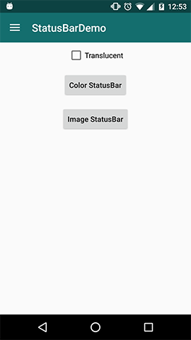
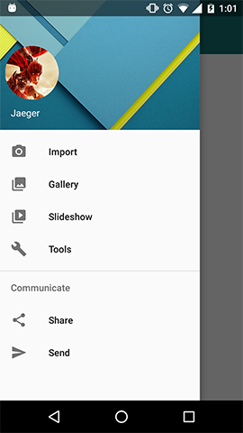
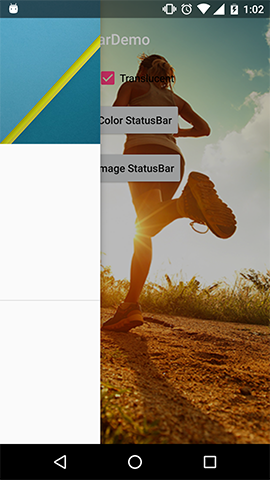

#### StatusBarDemo

1. `setColor(Activity activity, int color)`
	
	Set color of status bar
	
	
	
	
2. `setTranslucent(Activity activity)`
	
	Set translucent status bar
	
	
	
	
3. `setColorForDrawerLayout(Activity activity, DrawerLayout drawerLayout, int color)`
	
	Set color of status bar for DrawerLayout
	
	
	
4. `setTranslucentForDrawerLayout(Activity activity, DrawerLayout drawerLayout)`
	
	Set translucent status bar for DrawerLayout
	
	
	

[**StatusBarUtils.java**](https://github.com/laobie/StatusBarDemo/blob/master/app/src/main/java/com/jaeger/statusbardemo/StatusBarUtils.java)

[**Demo App download**](http://fir.im/5mnp)
