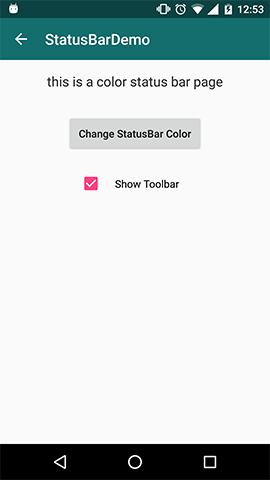
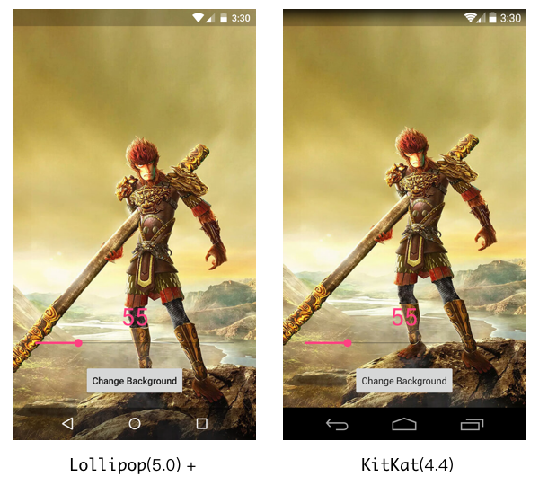
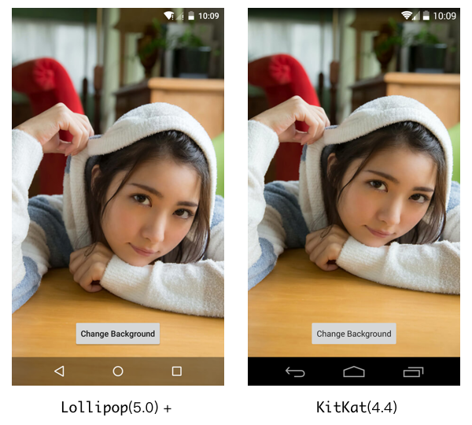
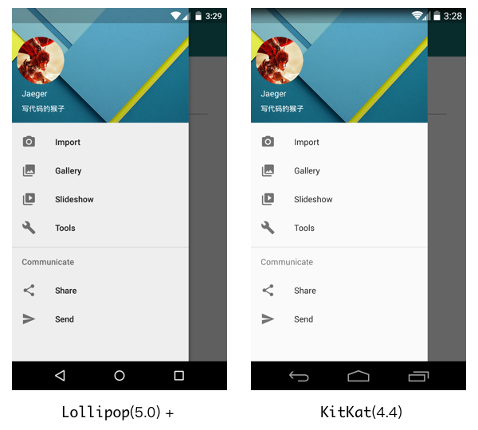
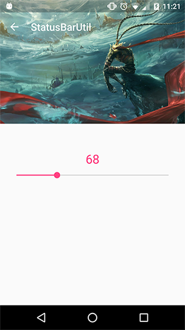
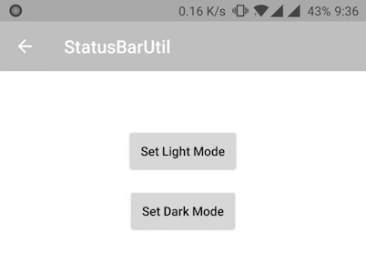
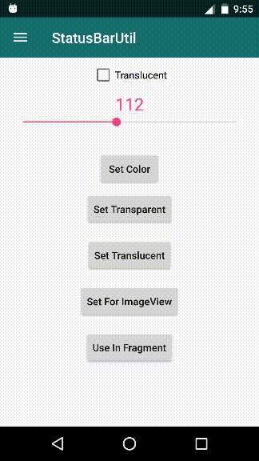
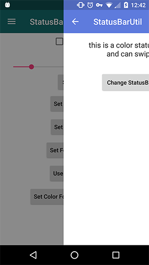

# StatusBarUtil
[](https://android-arsenal.com/details/1/3341)

[  ](https://bintray.com/laobie/maven/StatusBarUtil/_latestVersion)

A util for setting status bar style on Android App. It can work above API 19(KitKat 4.4).


[中文版点我](http://laobie.github.io/android/2016/03/27/statusbar-util.html)


### Sample

[Download StatusBarUtil-Demo](http://fir.im/5mnp)

### ChangeLog 

[CLICK ME](CHANGE_LOG.md)

### Usage

1. Add the dependencies to your build.gradle file, StatusBarUtil is avaiable in JCenter:

   ```groovy
   compile 'com.jaeger.statusbarutil:library:1.5.1'
   ```

   I fixed typo, change "statusbaruitl" to "statusbarutil", please notice this.

2. Call method you need after `setContentView()`,  such as :

   ```java
   setContentView(R.layout.main_activity);
   ...
   StatusBarUtil.setColor(MainActivity.this, mColor);
   ```

3. If you use this util in a page which containing a `DrawerLayout`, you need add `android:fitsSystemWindows="true"` for `DrawerLayout` in your layout XML:

   ```xml
   <android.support.v4.widget.DrawerLayout
       xmlns:android="http://schemas.android.com/apk/res/android"
       xmlns:app="http://schemas.android.com/apk/res-auto"
       android:id="@+id/drawer_layout"
       android:layout_width="match_parent"
       android:layout_height="match_parent"
       android:fitsSystemWindows="true">

       ...

   </android.support.v4.widget.DrawerLayout>
   ```

4. Set color for swipe back page

   Recommend using  with [bingoogolapple/BGASwipeBackLayout\-Android: Android Activity 滑动返回](https://github.com/bingoogolapple/BGASwipeBackLayout-Android)

   ```java
   StatusBarUtil.setColorForSwipeBack(Activity activity, @ColorInt int color, int statusBarAlpha)
   ```

5. All `statusBarAlpha` value you set should between 0 ~ 255

6. How to use in Fragment, please read [UseInFragmentActivity.java](https://github.com/laobie/StatusBarUtil/blob/master/sample/src/main/java/com/jaeger/statusbarutil/UseInFragmentActivity.java) 

   Handle all Fragments in ViewPager as ImageViewFragment, add a fake View in your Fragment layout as StatusBar :

   ```xml
   <?xml version="1.0" encoding="utf-8"?>
   <LinearLayout xmlns:android="http://schemas.android.com/apk/res/android"
       android:layout_width="match_parent"
       android:layout_height="match_parent"
       android:orientation="vertical">

       <View
           android:id="@+id/fake_statusbar_view"
           android:layout_width="match_parent"
           android:layout_height="@dimen/statusbar_view_height"
           android:background="@color/colorPrimary"/>

       <TextView
           android:id="@+id/tv_title"
           android:layout_width="match_parent"
           android:layout_height="56dp"
           android:background="@color/colorPrimary"
           android:gravity="center"
           android:text="@string/app_name"
           android:textColor="@color/white"
           android:textSize="24sp"/>   
   </LinearLayout>
   ```

   The fake StatusBar View height value ` statusbar_view_height`  defined in `dimens.xml`

   ```xml
   ~ values-v19/dimens.xml

   <dimen name="statusbar_view_height">25dp</dimen>

   ~ values/dimens.xml

   <dimen name="statusbar_view_height">0dp</dimen>
   ```

   When you change StatusBarColor :

   ```java
   mFakeStatusBar.setBackgroundColor(color);
   ```

   Then in the Activity which contains ViewPage, just invoke

   ```java
   StatusBarUtil.setTranslucentForImageViewInFragment(UseInFragmentActivity.this, null);
   ```

   Please read [UseInFragmentActivity.java](https://github.com/laobie/StatusBarUtil/blob/master/sample/src/main/java/com/jaeger/statusbarutil/UseInFragmentActivity.java) 

### Features

- Set status bar color

  ```java
  StatusBarUtil.setColor(Activity activity, int color)
  ```

  

- Set status bar translucent

  ```java
  StatusBarUtil.setTranslucent(Activity activity, int statusBarAlpha)
  ```

  

- Set status bar transparent

  ```java
  StatusBarUtil.setTransparent(Activity activity)
  ```

  

- Set status bar color for `DrawerLayout`

  ```java
  StatusBarUtil.setColorForDrawerLayout(Activity activity, DrawerLayout drawerLayout, int color)
  ```

  

- Set translucent status bar for using ImageView as head view page

  ```java
    StatusBarUtil.setTranslucentForImageView(Activity activity, int statusBarAlpha, View needOffsetView)
  ```
   


- Set Light or Dark mode

  ```
    StatusBarUtil.setLightMode(Activity activity)
    StatusBarUtil.setDarkMode(Activity activity)
  ```
    

- Use in fragment

   

- Set color for swipe back page

  ```java
    StatusBarUtil.setColorForSwipeBack(Activity activity, @ColorInt int color, int statusBarAlpha)
  ```

    

- Pass statusBarAlpha param when necessary to change your status bar alpha, which is 112 by default.


### License

	Copyright 2016 Jaeger Chen

	Licensed under the Apache License, Version 2.0 (the "License");	you may not use this file except in compliance with the License.
	You may obtain a copy of the License at
	
		http://www.apache.org/licenses/LICENSE-2.0
	
	Unless required by applicable law or agreed to in writing, software
	distributed under the License is distributed on an "AS IS" BASIS,
	WITHOUT WARRANTIES OR CONDITIONS OF ANY KIND, either express or implied.
	See the License for the specific language governing permissions and
	limitations under the License.
